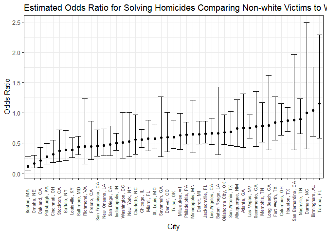

p8105\_hw6\_st3117
================
Sha Tao
November 15, 2018

Problem 1\_1 Load 'homicides' Data from Github
----------------------------------------------

``` r
p2_dataset = 
  RCurl::getURL("https://raw.githubusercontent.com/washingtonpost/data-homicides/master/homicide-data.csv") %>%
    read_csv()
```

Problem 1\_2 Clean Data
-----------------------

``` r
homicides =
  p2_dataset %>% 
  mutate(victim_race = fct_relevel(ifelse(victim_race == "White", "white", "non-white"), "white"),
         victim_age = ifelse(victim_age == "Unknown", NA, as.integer(victim_age)),
         victim_sex = as.factor(victim_sex),
         city_state = paste(paste0(city, ","), state),
         resolved = as.numeric(disposition == "Closed by arrest")) %>% 
  filter(!city_state %in% c("Dallas, TX", "Phoenix, AZ", "Kansas City, MO", "Tulsa, AL")) %>% 
  select(uid, victim_race, victim_age, victim_sex, city_state, resolved)
```

    ## Warning in ifelse(victim_age == "Unknown", NA, as.integer(victim_age)): NAs
    ## introduced by coercion

Problem 1\_3 Compute Odds Ratio and 95% CI for solving homicides in Baltimore
-----------------------------------------------------------------------------

``` r
baltimore_logistic = 
  homicides %>%
  filter(city_state == "Baltimore, MD") %>% 
  glm(resolved ~ victim_age + victim_sex + victim_race, data = ., family = binomial()) 

# save baltimore_logistic as an object
save(baltimore_logistic, file = "Baltimore_logistic.RData")

baltimore_logistic %>% 
  broom::tidy() %>% 
  mutate(OR = exp(estimate),
         conf.low = exp(estimate - 1.96 * std.error),
         conf.high = exp(estimate + 1.96 * std.error)) %>% 
  filter(term == "victim_racenon-white") %>% 
  select(beta = estimate, p.value, OR, conf.low, conf.high) %>% 
  knitr::kable(digit = 3)
```

|   beta|  p.value|     OR|  conf.low|  conf.high|
|------:|--------:|------:|---------:|----------:|
|  -0.82|        0|  0.441|     0.313|       0.62|

Problem 1\_4 Compute Odds Ratio and 95% CI for solving homicides in All Cities
------------------------------------------------------------------------------

``` r
# create function for all city logistic regression
city_logistic = function(x){
  
    homicides %>% 
    filter(city_state == x) %>% 
    glm(resolved ~ victim_age + victim_sex + victim_race, data = ., family = binomial())  %>% 
    broom::tidy() %>% 
    mutate(OR = exp(estimate),
           conf.low = exp(estimate - 1.96 * std.error),
           conf.high = exp(estimate + 1.96 * std.error)) %>% 
    filter(term == "victim_racenon-white") %>% 
    select(beta = estimate, p.value, OR, conf.low, conf.high)

}

# compute all cities' logistic regression
city_result = 
  tibble(city_state = unique(homicides$city_state)) %>% 
  mutate(map(.x = unique(homicides$city_state), ~city_logistic(.x))) %>% 
  unnest
```

Problem 1\_5 Show Estimated Odds Ratio for Solving Homicides Comparing Non-white Victims to White Victims
---------------------------------------------------------------------------------------------------------

``` r
city_result %>% 
  ggplot(aes(x = reorder(city_state, OR), y = OR)) +
    geom_point() +
    geom_errorbar(aes(ymin = conf.low, ymax = conf.high)) +
    theme(axis.text.x = element_text(angle = 90, vjust = 0.3, size = 7)) +
    labs(
      x = "City",
      y = "Odds Ratio",
      title = "Estimated Odds Ratio for Solving Homicides Comparing Non-white Victims to White Victims"
    )
```



Problem 2\_1 Load 'Children Birth Weight' Data
----------------------------------------------

``` r
children = 
  read_csv(file = "./data/birthweight.csv")
```

    ## Parsed with column specification:
    ## cols(
    ##   .default = col_integer(),
    ##   gaweeks = col_double(),
    ##   ppbmi = col_double(),
    ##   smoken = col_double()
    ## )

    ## See spec(...) for full column specifications.

``` r
skimr::skim(children)
```

    ## Skim summary statistics
    ##  n obs: 4342 
    ##  n variables: 20 
    ## 
    ## -- Variable type:integer ----------------------------------------------------------------------------------------------
    ##  variable missing complete    n      mean      sd  p0  p25    p50  p75
    ##   babysex       0     4342 4342    1.49     0.5     1    1    1      2
    ##     bhead       0     4342 4342   33.65     1.62   21   33   34     35
    ##   blength       0     4342 4342   49.75     2.72   20   48   50     51
    ##       bwt       0     4342 4342 3114.4    512.15  595 2807 3132.5 3459
    ##     delwt       0     4342 4342  145.57    22.21   86  131  143    157
    ##   fincome       0     4342 4342   44.11    25.98    0   25   35     65
    ##     frace       0     4342 4342    1.66     0.85    1    1    2      2
    ##   malform       0     4342 4342    0.0035   0.059   0    0    0      0
    ##  menarche       0     4342 4342   12.51     1.48    0   12   12     13
    ##   mheight       0     4342 4342   63.49     2.66   48   62   63     65
    ##    momage       0     4342 4342   20.3      3.88   12   18   20     22
    ##     mrace       0     4342 4342    1.63     0.77    1    1    2      2
    ##    parity       0     4342 4342    0.0023   0.1     0    0    0      0
    ##   pnumlbw       0     4342 4342    0        0       0    0    0      0
    ##   pnumsga       0     4342 4342    0        0       0    0    0      0
    ##      ppwt       0     4342 4342  123.49    20.16   70  110  120    134
    ##    wtgain       0     4342 4342   22.08    10.94  -46   15   22     28
    ##  p100     hist
    ##     2 <U+2587><U+2581><U+2581><U+2581><U+2581><U+2581><U+2581><U+2587>
    ##    41 <U+2581><U+2581><U+2581><U+2581><U+2585><U+2587><U+2581><U+2581>
    ##    63 <U+2581><U+2581><U+2581><U+2581><U+2581><U+2587><U+2581><U+2581>
    ##  4791 <U+2581><U+2581><U+2581><U+2583><U+2587><U+2587><U+2582><U+2581>
    ##   334 <U+2581><U+2587><U+2585><U+2581><U+2581><U+2581><U+2581><U+2581>
    ##    96 <U+2581><U+2582><U+2587><U+2582><U+2582><U+2582><U+2581><U+2583>
    ##     8 <U+2587><U+2587><U+2581><U+2581><U+2581><U+2581><U+2581><U+2581>
    ##     1 <U+2587><U+2581><U+2581><U+2581><U+2581><U+2581><U+2581><U+2581>
    ##    19 <U+2581><U+2581><U+2581><U+2581><U+2582><U+2587><U+2581><U+2581>
    ##    77 <U+2581><U+2581><U+2581><U+2585><U+2587><U+2582><U+2581><U+2581>
    ##    44 <U+2582><U+2587><U+2585><U+2582><U+2581><U+2581><U+2581><U+2581>
    ##     4 <U+2587><U+2581><U+2587><U+2581><U+2581><U+2581><U+2581><U+2581>
    ##     6 <U+2587><U+2581><U+2581><U+2581><U+2581><U+2581><U+2581><U+2581>
    ##     0 <U+2581><U+2581><U+2581><U+2587><U+2581><U+2581><U+2581><U+2581>
    ##     0 <U+2581><U+2581><U+2581><U+2587><U+2581><U+2581><U+2581><U+2581>
    ##   287 <U+2581><U+2587><U+2586><U+2581><U+2581><U+2581><U+2581><U+2581>
    ##    89 <U+2581><U+2581><U+2581><U+2587><U+2587><U+2581><U+2581><U+2581>
    ## 
    ## -- Variable type:numeric ----------------------------------------------------------------------------------------------
    ##  variable missing complete    n  mean   sd    p0   p25   p50   p75 p100
    ##   gaweeks       0     4342 4342 39.43 3.15 17.7  38.3  39.9  41.1  51.3
    ##     ppbmi       0     4342 4342 21.57 3.18 13.07 19.53 21.03 22.91 46.1
    ##    smoken       0     4342 4342  4.15 7.41  0     0     0     5    60  
    ##      hist
    ##  <U+2581><U+2581><U+2581><U+2581><U+2583><U+2587><U+2581><U+2581>
    ##  <U+2581><U+2587><U+2585><U+2581><U+2581><U+2581><U+2581><U+2581>
    ##  <U+2587><U+2581><U+2581><U+2581><U+2581><U+2581><U+2581><U+2581>

There was no missing data in the dataset.

Problem 2\_2 Propose a regression model for birthweight
-------------------------------------------------------

``` r
null_model = lm(bwt ~ 1, data = children)
full_model = lm(bwt ~ ., data = children)

stepwise = step(null_model, scope = list(upper = full_model), data = children, direction = "both")
```

    ## Start:  AIC=54177.22
    ## bwt ~ 1
    ## 
    ##            Df Sum of Sq        RSS   AIC
    ## + bhead     1 635559826  503092368 50633
    ## + blength   1 629354727  509297466 50686
    ## + gaweeks   1 193451443  945200751 53371
    ## + delwt     1  94371782 1044280412 53804
    ## + wtgain    1  69610184 1069042010 53905
    ## + mrace     1  49105959 1089546235 53988
    ## + mheight   1  42046665 1096605529 54016
    ## + ppwt      1  38087313 1100564881 54032
    ## + frace     1  36642711 1102009482 54037
    ## + fincome   1  27205079 1111447115 54074
    ## + momage    1  20990388 1117661805 54098
    ## + ppbmi     1  10049517 1128602677 54141
    ## + babysex   1   8547634 1130104560 54147
    ## + smoken    1   6512595 1132139598 54154
    ## + menarche  1    679279 1137972914 54177
    ## <none>                  1138652193 54177
    ## + parity    1     79849 1138572345 54179
    ## + malform   1      2024 1138650169 54179
    ## 
    ## Step:  AIC=50632.56
    ## bwt ~ bhead
    ## 
    ##            Df Sum of Sq        RSS   AIC
    ## + blength   1 140260834  362831534 49215
    ## + gaweeks   1  22265695  480826672 50438
    ## + delwt     1  19472338  483620030 50463
    ## + mrace     1  18119918  484972449 50475
    ## + wtgain    1  14330260  488762108 50509
    ## + frace     1  13307831  489784537 50518
    ## + mheight   1  12676960  490415408 50524
    ## + ppwt      1   7580954  495511414 50569
    ## + fincome   1   5357287  497735081 50588
    ## + momage    1   3488320  499604047 50604
    ## + babysex   1   1825927  501266440 50619
    ## + smoken    1   1424897  501667471 50622
    ## + ppbmi     1    983475  502108893 50626
    ## + menarche  1    559731  502532637 50630
    ## <none>                   503092368 50633
    ## + parity    1     49583  503042785 50634
    ## + malform   1       934  503091433 50635
    ## - bhead     1 635559826 1138652193 54177
    ## 
    ## Step:  AIC=49215.44
    ## bwt ~ bhead + blength
    ## 
    ##            Df Sum of Sq       RSS   AIC
    ## + mrace     1  10890076 351941458 49085
    ## + delwt     1   8805086 354026448 49111
    ## + frace     1   8097243 354734291 49119
    ## + gaweeks   1   7667503 355164031 49125
    ## + wtgain    1   6887951 355943583 49134
    ## + mheight   1   5041499 357790035 49157
    ## + fincome   1   4952952 357878582 49158
    ## + ppwt      1   3229239 359602295 49179
    ## + momage    1   2833954 359997579 49183
    ## + babysex   1   1778849 361052685 49196
    ## + smoken    1    505774 362325760 49211
    ## + ppbmi     1    481792 362349742 49212
    ## + parity    1    276204 362555330 49214
    ## + menarche  1    207816 362623718 49215
    ## <none>                  362831534 49215
    ## + malform   1     18474 362813059 49217
    ## - blength   1 140260834 503092368 50633
    ## - bhead     1 146465932 509297466 50686
    ## 
    ## Step:  AIC=49085.13
    ## bwt ~ bhead + blength + mrace
    ## 
    ##            Df Sum of Sq       RSS   AIC
    ## + delwt     1   7675442 344266015 48991
    ## + wtgain    1   6819240 345122218 49002
    ## + gaweeks   1   6231307 345710151 49010
    ## + ppwt      1   2524414 349417044 49056
    ## + mheight   1   2489538 349451920 49056
    ## + smoken    1   2054326 349887132 49062
    ## + babysex   1   1941198 350000259 49063
    ## + fincome   1   1707240 350234218 49066
    ## + momage    1   1081027 350860431 49074
    ## + ppbmi     1    723007 351218451 49078
    ## + parity    1    268672 351672786 49084
    ## + menarche  1    175525 351765933 49085
    ## <none>                  351941458 49085
    ## + frace     1     45231 351896227 49087
    ## + malform   1      1687 351939771 49087
    ## - mrace     1  10890076 362831534 49215
    ## - blength   1 133030992 484972449 50475
    ## - bhead     1 143542003 495483461 50568
    ## 
    ## Step:  AIC=48991.38
    ## bwt ~ bhead + blength + mrace + delwt
    ## 
    ##            Df Sum of Sq       RSS   AIC
    ## + gaweeks   1   5928346 338337669 48918
    ## + ppbmi     1   2920956 341345060 48956
    ## + ppwt      1   2729495 341536520 48959
    ## + wtgain    1   2729495 341536520 48959
    ## + smoken    1   2529792 341736223 48961
    ## + babysex   1   1778485 342487530 48971
    ## + fincome   1   1772487 342493529 48971
    ## + momage    1    867321 343398695 48982
    ## + mheight   1    303222 343962794 48990
    ## + parity    1    261148 344004867 48990
    ## <none>                  344266015 48991
    ## + frace     1     77020 344188995 48992
    ## + menarche  1     34496 344231519 48993
    ## + malform   1        68 344265947 48993
    ## - delwt     1   7675442 351941458 49085
    ## - mrace     1   9760432 354026448 49111
    ## - blength   1 123714334 467980349 50322
    ## - bhead     1 136442633 480708648 50439
    ## 
    ## Step:  AIC=48917.96
    ## bwt ~ bhead + blength + mrace + delwt + gaweeks
    ## 
    ##            Df Sum of Sq       RSS   AIC
    ## + smoken    1   2952073 335385596 48882
    ## + ppbmi     1   2655504 335682165 48886
    ## + ppwt      1   2220964 336116705 48891
    ## + wtgain    1   2220964 336116705 48891
    ## + fincome   1   1494649 336843020 48901
    ## + babysex   1   1227442 337110227 48904
    ## + momage    1    613908 337723761 48912
    ## + parity    1    484599 337853070 48914
    ## + mheight   1    386277 337951392 48915
    ## <none>                  338337669 48918
    ## + frace     1     68932 338268737 48919
    ## + menarche  1     41994 338295675 48919
    ## + malform   1       664 338337005 48920
    ## - gaweeks   1   5928346 344266015 48991
    ## - delwt     1   7372482 345710151 49010
    ## - mrace     1   8461127 346798796 49023
    ## - blength   1 112356584 450694252 50161
    ## - bhead     1 119550781 457888450 50230
    ## 
    ## Step:  AIC=48881.91
    ## bwt ~ bhead + blength + mrace + delwt + gaweeks + smoken
    ## 
    ##            Df Sum of Sq       RSS   AIC
    ## + ppbmi     1   2793408 332592188 48848
    ## + ppwt      1   2316748 333068847 48854
    ## + wtgain    1   2316748 333068847 48854
    ## + fincome   1   1594545 333791051 48863
    ## + babysex   1   1078759 334306837 48870
    ## + momage    1    718770 334666826 48875
    ## + parity    1    473502 334912093 48878
    ## + mheight   1    408618 334976977 48879
    ## <none>                  335385596 48882
    ## + frace     1     86942 335298653 48883
    ## + menarche  1     27690 335357906 48884
    ## + malform   1      5264 335380331 48884
    ## - smoken    1   2952073 338337669 48918
    ## - gaweeks   1   6350627 341736223 48961
    ## - delwt     1   7869483 343255079 48981
    ## - mrace     1  10209847 345595443 49010
    ## - blength   1 109141526 444527121 50103
    ## - bhead     1 117911413 453297008 50188
    ## 
    ## Step:  AIC=48847.6
    ## bwt ~ bhead + blength + mrace + delwt + gaweeks + smoken + ppbmi
    ## 
    ##            Df Sum of Sq       RSS   AIC
    ## + fincome   1   1535480 331056708 48830
    ## + babysex   1   1041293 331550895 48836
    ## + momage    1    981058 331611130 48837
    ## + parity    1    449675 332142512 48844
    ## + ppwt      1    299968 332292220 48846
    ## + wtgain    1    299968 332292220 48846
    ## + mheight   1    253207 332338981 48846
    ## <none>                  332592188 48848
    ## + menarche  1     99203 332492985 48848
    ## + frace     1     67958 332524230 48849
    ## + malform   1      3171 332589017 48850
    ## - ppbmi     1   2793408 335385596 48882
    ## - smoken    1   3089977 335682165 48886
    ## - gaweeks   1   6079724 338671911 48924
    ## - mrace     1   8802003 341394191 48959
    ## - delwt     1   9847342 342439529 48972
    ## - blength   1 105688684 438280872 50044
    ## - bhead     1 117431088 450023275 50159
    ## 
    ## Step:  AIC=48829.5
    ## bwt ~ bhead + blength + mrace + delwt + gaweeks + smoken + ppbmi + 
    ##     fincome
    ## 
    ##            Df Sum of Sq       RSS   AIC
    ## + babysex   1   1044013 330012695 48818
    ## + parity    1    487401 330569306 48825
    ## + momage    1    460369 330596339 48825
    ## + ppwt      1    411101 330645607 48826
    ## + wtgain    1    411101 330645607 48826
    ## + mheight   1    361520 330695187 48827
    ## <none>                  331056708 48830
    ## + menarche  1     97194 330959513 48830
    ## + frace     1     35549 331021159 48831
    ## + malform   1      5953 331050755 48831
    ## - fincome   1   1535480 332592188 48848
    ## - ppbmi     1   2734344 333791051 48863
    ## - smoken    1   3188687 334245394 48869
    ## - gaweeks   1   5805639 336862346 48903
    ## - mrace     1   6264275 337320983 48909
    ## - delwt     1   9826238 340882945 48955
    ## - blength   1 106210582 437267289 50036
    ## - bhead     1 115028496 446085204 50122
    ## 
    ## Step:  AIC=48817.79
    ## bwt ~ bhead + blength + mrace + delwt + gaweeks + smoken + ppbmi + 
    ##     fincome + babysex
    ## 
    ##            Df Sum of Sq       RSS   AIC
    ## + momage    1    490263 329522432 48813
    ## + ppwt      1    453276 329559418 48814
    ## + wtgain    1    453276 329559418 48814
    ## + parity    1    450013 329562682 48814
    ## + mheight   1    398860 329613834 48815
    ## <none>                  330012695 48818
    ## + menarche  1     93345 329919349 48819
    ## + frace     1     35541 329977154 48819
    ## + malform   1      8735 330003959 48820
    ## - babysex   1   1044013 331056708 48830
    ## - fincome   1   1538200 331550895 48836
    ## - ppbmi     1   2697185 332709880 48851
    ## - smoken    1   3035456 333048151 48856
    ## - gaweeks   1   5289271 335301965 48885
    ## - mrace     1   6357699 336370393 48899
    ## - delwt     1   9674936 339687631 48941
    ## - blength   1 106562899 436575594 50031
    ## - bhead     1 115695672 445708367 50121
    ## 
    ## Step:  AIC=48813.33
    ## bwt ~ bhead + blength + mrace + delwt + gaweeks + smoken + ppbmi + 
    ##     fincome + babysex + momage
    ## 
    ##            Df Sum of Sq       RSS   AIC
    ## + ppwt      1    570806 328951626 48808
    ## + wtgain    1    570806 328951626 48808
    ## + mheight   1    506227 329016205 48809
    ## + parity    1    387715 329134717 48810
    ## + menarche  1    210070 329312362 48813
    ## <none>                  329522432 48813
    ## + frace     1     33829 329488603 48815
    ## + malform   1      6658 329515774 48815
    ## - momage    1    490263 330012695 48818
    ## - fincome   1   1004962 330527395 48825
    ## - babysex   1   1073906 330596339 48825
    ## - ppbmi     1   2886043 332408475 48849
    ## - smoken    1   3114021 332636454 48852
    ## - gaweeks   1   5101287 334623719 48878
    ## - mrace     1   5876355 335398787 48888
    ## - delwt     1   9826763 339349195 48939
    ## - blength   1 106564361 436086793 50028
    ## - bhead     1 115077327 444599759 50112
    ## 
    ## Step:  AIC=48807.81
    ## bwt ~ bhead + blength + mrace + delwt + gaweeks + smoken + ppbmi + 
    ##     fincome + babysex + momage + ppwt
    ## 
    ##            Df Sum of Sq       RSS   AIC
    ## + parity    1    360899 328590727 48805
    ## + menarche  1    162913 328788714 48808
    ## <none>                  328951626 48808
    ## + frace     1     38459 328913167 48809
    ## + mheight   1     13826 328937800 48810
    ## + malform   1      3298 328948329 48810
    ## - ppwt      1    570806 329522432 48813
    ## - ppbmi     1    588450 329540076 48814
    ## - momage    1    607792 329559418 48814
    ## - fincome   1   1067015 330018642 48820
    ## - babysex   1   1125947 330077573 48821
    ## - smoken    1   3133367 332084994 48847
    ## - gaweeks   1   4825985 333777611 48869
    ## - mrace     1   6215164 335166790 48887
    ## - delwt     1   7695086 336646712 48906
    ## - blength   1 106741654 435693280 50026
    ## - bhead     1 114217596 443169223 50100
    ## 
    ## Step:  AIC=48805.04
    ## bwt ~ bhead + blength + mrace + delwt + gaweeks + smoken + ppbmi + 
    ##     fincome + babysex + momage + ppwt + parity
    ## 
    ##            Df Sum of Sq       RSS   AIC
    ## + menarche  1    166297 328424430 48805
    ## <none>                  328590727 48805
    ## + frace     1     37766 328552961 48807
    ## + mheight   1     16110 328574617 48807
    ## + malform   1      3604 328587123 48807
    ## - parity    1    360899 328951626 48808
    ## - momage    1    537454 329128181 48810
    ## - ppwt      1    543990 329134717 48810
    ## - ppbmi     1    594749 329185477 48811
    ## - babysex   1   1087672 329678400 48817
    ## - fincome   1   1114837 329705564 48818
    ## - smoken    1   3120707 331711434 48844
    ## - gaweeks   1   5012207 333602934 48869
    ## - mrace     1   6187390 334778117 48884
    ## - delwt     1   7589431 336180158 48902
    ## - blength   1 106898567 435489294 50026
    ## - bhead     1 113962393 442553120 50096
    ## 
    ## Step:  AIC=48804.84
    ## bwt ~ bhead + blength + mrace + delwt + gaweeks + smoken + ppbmi + 
    ##     fincome + babysex + momage + ppwt + parity + menarche
    ## 
    ##            Df Sum of Sq       RSS   AIC
    ## <none>                  328424430 48805
    ## - menarche  1    166297 328590727 48805
    ## + frace     1     33865 328390565 48806
    ## + mheight   1     15619 328408811 48807
    ## + malform   1      3043 328421387 48807
    ## - parity    1    364284 328788714 48808
    ## - ppwt      1    497500 328921930 48809
    ## - momage    1    637709 329062139 48811
    ## - ppbmi     1    668497 329092927 48812
    ## - fincome   1   1057703 329482133 48817
    ## - babysex   1   1083795 329508226 48817
    ## - smoken    1   3099561 331523991 48844
    ## - gaweeks   1   5011174 333435604 48869
    ## - mrace     1   6063767 334488197 48882
    ## - delwt     1   7482151 335906581 48901
    ## - blength   1 106668411 435092841 50024
    ## - bhead     1 114064592 442489022 50097

``` r
stepwise %>% broom::tidy()
```

    ## # A tibble: 14 x 5
    ##    term         estimate std.error statistic   p.value
    ##    <chr>           <dbl>     <dbl>     <dbl>     <dbl>
    ##  1 (Intercept) -5901.      109.       -53.9  0.       
    ##  2 bhead         134.        3.47      38.8  1.63e-282
    ##  3 blength        76.4       2.04      37.5  1.16e-266
    ##  4 mrace         -53.7       6.01      -8.94 5.70e- 19
    ##  5 delwt           3.96      0.398      9.93 5.43e- 23
    ##  6 gaweeks        12.0       1.48       8.13 5.72e- 16
    ##  7 smoken         -3.72      0.581     -6.39 1.82e- 10
    ##  8 ppbmi          -7.77      2.62      -2.97 3.01e-  3
    ##  9 fincome         0.662     0.177      3.73 1.91e-  4
    ## 10 babysex        32.3       8.55       3.78 1.59e-  4
    ## 11 momage          3.46      1.19       2.90 3.76e-  3
    ## 12 ppwt           -1.48      0.579     -2.56 1.05e-  2
    ## 13 parity         89.6      40.9        2.19 2.85e-  2
    ## 14 menarche       -4.33      2.92      -1.48 1.39e-  1

``` r
proposed_model1 = lm(bwt ~ bhead + blength + babysex + delwt + mrace + gaweeks, data = children)
proposed_model2 = mgcv::gam(bwt ~ s(bhead) + s(blength) + babysex + s(delwt) + mrace +s(gaweeks), data = children)
```

Step-wise selection is a data-driven model-building process, by performing it, we got 13 significant variables. By simplily searching the association between birth weight and the 13 variables online, I narrowed it down to 6 variables: baby’s head circumference at birth, baby’s length at birth, baby’s sex, mother’s weight at delivery, mother’s race, and gestational age in weeks.

At first, I just propsed the linear model "proposed\_model1", however, since the residual vs. fit below showed some violiation of our linear assumption, I decided to include a non-linear "proposed\_model2" with the same 6 variables.

Problem 2\_3 Residual vs. Fit Plots
-----------------------------------

``` r
resid_fit1 = 
  children %>% 
  add_predictions(model = proposed_model1) %>% 
  add_residuals(model = proposed_model1)

ggplot(resid_fit1, aes(x = pred, y = resid)) +
    geom_point() +
    labs(
      x = "Prediction",
      y = "Residual",
      title = "Residual vs. Fit For Proposed Model 1"
    )
```


``` r
resid_fit2 = 
  children %>% 
  add_predictions(model = proposed_model2) %>% 
  add_residuals(model = proposed_model2)

ggplot(resid_fit2, aes(x = pred, y = resid)) +
    geom_point() +
    labs(
      x = "Prediction",
      y = "Residual",
      title = "Residual vs. Fit For Proposed Model 2"
    )
```


Three characteristics of a well-behaved residual vs. fits plot: \* The residuals "bounce randomly" around the 0 line. T \* The residuals roughly form a "horizontal band" around the 0 line. \* No one residual "stands out" from the basic random pattern of residuals.

The residual vs. fits plot for proposed model 1 has some has some obvious outliers when the predicted birth weight less than 2000 grams. Thus, I proposed a non-linear proposed model 2 in the previous sections, and the plot has fairly random scatter pattern around the 0 line.

Problem 2\_4 Training / Testing Split
-------------------------------------

``` r
cv_children =
  crossv_mc(children, 100) %>% 
  mutate(train = map(train, as_tibble),
         test = map(test, as_tibble))
```

Problem 2\_5 List Columns of the Models and Their RMSE
------------------------------------------------------

``` r
cv_children_test = 
  cv_children %>% 
  mutate(adjust_mod_1 = map(train, ~lm(bwt ~ blength + gaweeks, data = .x)),
         adjust_mod_2 = map(train, ~lm(bwt ~ bhead * blength * babysex, data = .x)),
         proposed_mod1 = map(train, ~lm(bwt ~ bhead + blength + babysex + delwt + mrace + gaweeks, data = .x)),
         proposed_mod2 = map(train, ~mgcv::gam(bwt ~ s(bhead) + s(blength) + babysex +s(delwt) + mrace + 
                                                 s(gaweeks), data = .x))) %>% 
  mutate(rmse_adj_1 = map2_dbl(adjust_mod_1, test, ~rmse(model = .x, data = .y)),
         rmse_adj_2 = map2_dbl(adjust_mod_2, test, ~rmse(model = .x, data = .y)),
         rmse_propsed1 = map2_dbl(proposed_mod1, test, ~rmse(model = .x, data = .y)),
         rmse_propsed2 = map2_dbl(proposed_mod2, test, ~rmse(model = .x, data = .y)))
```

Problem 2\_6 Models' Comparison Using Violin Plot
-------------------------------------------------

``` r
cv_children_test %>% 
  select(starts_with("rmse")) %>% 
  gather(key = model, value = rmse) %>% 
  mutate(model = str_replace(model, "rmse_", ""),
         model = fct_inorder(model)) %>% 
  ggplot(aes(x = model, y = rmse)) + geom_violin()
```


Based on the violin plot, our proposed model 2 has the smallest RMSE, thus I'll choose this model among the 4 models.
