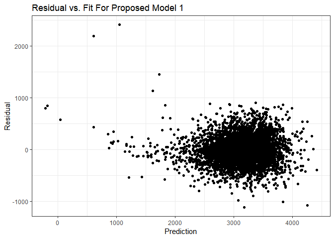

p8105\_hw6\_st3117
================
Sha Tao
November 15, 2018

Problem 1\_1 Load 'homicides' Data from Github
----------------------------------------------

``` r
p2_dataset = 
  RCurl::getURL("https://raw.githubusercontent.com/washingtonpost/data-homicides/master/homicide-data.csv") %>%
    read_csv()
```

Problem 1\_2 Clean Data
-----------------------

``` r
homicides =
  p2_dataset %>% 
  mutate(victim_race = fct_relevel(ifelse(victim_race == "White", "white", "non-white"), "white"),
         victim_age = ifelse(victim_age == "Unknown", NA, as.integer(victim_age)),
         victim_sex = as.factor(victim_sex),
         city_state = paste(paste0(city, ","), state),
         resolved = as.numeric(disposition == "Closed by arrest")) %>% 
  filter(!city_state %in% c("Dallas, TX", "Phoenix, AZ", "Kansas City, MO", "Tulsa, AL")) %>% 
  select(uid, victim_race, victim_age, victim_sex, city_state, resolved)
```

Problem 1\_3 Compute Odds Ratio and 95% CI for solving homicides in Baltimore
-----------------------------------------------------------------------------

``` r
# filter out Baltimore and do logistic regression
baltimore_logistic = 
  homicides %>%
  filter(city_state == "Baltimore, MD") %>% 
  glm(resolved ~ victim_age + victim_sex + victim_race, data = ., family = binomial()) 

# save baltimore_logistic as an object
# I got a comment for homework 5 that I did't need to actually save it as an R object, thus I'll leave it as a comment
# save(baltimore_logistic, file = "Baltimore_logistic.RData")

# compute and tidy the logistic result
baltimore_logistic %>% 
  broom::tidy() %>% 
  mutate(OR = exp(estimate),
         conf.low = exp(estimate - 1.96 * std.error),
         conf.high = exp(estimate + 1.96 * std.error)) %>% 
  filter(term == "victim_racenon-white") %>% 
  select(beta = estimate, p.value, OR, conf.low, conf.high) %>% 
  knitr::kable(digit = 3)
```

|   beta|  p.value|     OR|  conf.low|  conf.high|
|------:|--------:|------:|---------:|----------:|
|  -0.82|        0|  0.441|     0.313|       0.62|

Problem 1\_4 Compute Odds Ratio and 95% CI for solving homicides in All Cities
------------------------------------------------------------------------------

``` r
# create function for all city logistic regression
city_logistic = function(x){
  
    homicides %>% 
    filter(city_state == x) %>% 
    glm(resolved ~ victim_age + victim_sex + victim_race, data = ., family = binomial())  %>% 
    broom::tidy() %>% 
    mutate(OR = exp(estimate),
           conf.low = exp(estimate - 1.96 * std.error),
           conf.high = exp(estimate + 1.96 * std.error)) %>% 
    filter(term == "victim_racenon-white") %>% 
    select(beta = estimate, p.value, OR, conf.low, conf.high)

}

# compute all cities' logistic regression
city_result = 
  tibble(city_state = unique(homicides$city_state)) %>% 
  mutate(map(.x = unique(homicides$city_state), ~city_logistic(.x))) %>% 
  unnest

# check some of the all cities' logistic regression result
city_result %>% 
  head() %>% 
  knitr::kable(digit = 3)
```

| city\_state     |    beta|  p.value|     OR|  conf.low|  conf.high|
|:----------------|-------:|--------:|------:|---------:|----------:|
| Albuquerque, NM |  -0.299|    0.238|  0.741|     0.451|      1.218|
| Atlanta, GA     |  -0.284|    0.317|  0.753|     0.432|      1.313|
| Baltimore, MD   |  -0.820|    0.000|  0.441|     0.313|      0.620|
| Baton Rouge, LA |  -0.404|    0.296|  0.668|     0.313|      1.425|
| Birmingham, AL  |   0.039|    0.886|  1.039|     0.615|      1.756|
| Boston, MA      |  -2.167|    0.000|  0.115|     0.047|      0.278|

Problem 1\_5 Show Estimated Odds Ratio for Solving Homicides Comparing Non-white Victims to White Victims
---------------------------------------------------------------------------------------------------------

``` r
city_result %>% 
  ggplot(aes(x = reorder(city_state, OR), y = OR)) +
    geom_point() +
    geom_errorbar(aes(ymin = conf.low, ymax = conf.high)) +
    theme(axis.text.x = element_text(angle = 90, vjust = 0.3, size = 7)) +
    labs(
      x = "City",
      y = "Odds Ratio",
      title = "Estimated Odds Ratio for Solving Homicides Comparing Non-white to White"
    )
```


Among all cities, Tampa, FL had the highest odds ratio for solving homicides comparing non-white victims to white victims, while Boston, MA had the lowest odds ratio.
Durham, NC had the widest 95% CI.

Problem 2\_1 Load 'Children Birth Weight' Data
----------------------------------------------

``` r
children = 
  read_csv(file = "./data/birthweight.csv")

skimr::skim(children)
```

    ## Skim summary statistics
    ##  n obs: 4342 
    ##  n variables: 20 
    ## 
    ## -- Variable type:integer ----------------------------------------------------------------------------------------------
    ##  variable missing complete    n      mean      sd  p0  p25    p50  p75
    ##   babysex       0     4342 4342    1.49     0.5     1    1    1      2
    ##     bhead       0     4342 4342   33.65     1.62   21   33   34     35
    ##   blength       0     4342 4342   49.75     2.72   20   48   50     51
    ##       bwt       0     4342 4342 3114.4    512.15  595 2807 3132.5 3459
    ##     delwt       0     4342 4342  145.57    22.21   86  131  143    157
    ##   fincome       0     4342 4342   44.11    25.98    0   25   35     65
    ##     frace       0     4342 4342    1.66     0.85    1    1    2      2
    ##   malform       0     4342 4342    0.0035   0.059   0    0    0      0
    ##  menarche       0     4342 4342   12.51     1.48    0   12   12     13
    ##   mheight       0     4342 4342   63.49     2.66   48   62   63     65
    ##    momage       0     4342 4342   20.3      3.88   12   18   20     22
    ##     mrace       0     4342 4342    1.63     0.77    1    1    2      2
    ##    parity       0     4342 4342    0.0023   0.1     0    0    0      0
    ##   pnumlbw       0     4342 4342    0        0       0    0    0      0
    ##   pnumsga       0     4342 4342    0        0       0    0    0      0
    ##      ppwt       0     4342 4342  123.49    20.16   70  110  120    134
    ##    wtgain       0     4342 4342   22.08    10.94  -46   15   22     28
    ##  p100     hist
    ##     2 <U+2587><U+2581><U+2581><U+2581><U+2581><U+2581><U+2581><U+2587>
    ##    41 <U+2581><U+2581><U+2581><U+2581><U+2585><U+2587><U+2581><U+2581>
    ##    63 <U+2581><U+2581><U+2581><U+2581><U+2581><U+2587><U+2581><U+2581>
    ##  4791 <U+2581><U+2581><U+2581><U+2583><U+2587><U+2587><U+2582><U+2581>
    ##   334 <U+2581><U+2587><U+2585><U+2581><U+2581><U+2581><U+2581><U+2581>
    ##    96 <U+2581><U+2582><U+2587><U+2582><U+2582><U+2582><U+2581><U+2583>
    ##     8 <U+2587><U+2587><U+2581><U+2581><U+2581><U+2581><U+2581><U+2581>
    ##     1 <U+2587><U+2581><U+2581><U+2581><U+2581><U+2581><U+2581><U+2581>
    ##    19 <U+2581><U+2581><U+2581><U+2581><U+2582><U+2587><U+2581><U+2581>
    ##    77 <U+2581><U+2581><U+2581><U+2585><U+2587><U+2582><U+2581><U+2581>
    ##    44 <U+2582><U+2587><U+2585><U+2582><U+2581><U+2581><U+2581><U+2581>
    ##     4 <U+2587><U+2581><U+2587><U+2581><U+2581><U+2581><U+2581><U+2581>
    ##     6 <U+2587><U+2581><U+2581><U+2581><U+2581><U+2581><U+2581><U+2581>
    ##     0 <U+2581><U+2581><U+2581><U+2587><U+2581><U+2581><U+2581><U+2581>
    ##     0 <U+2581><U+2581><U+2581><U+2587><U+2581><U+2581><U+2581><U+2581>
    ##   287 <U+2581><U+2587><U+2586><U+2581><U+2581><U+2581><U+2581><U+2581>
    ##    89 <U+2581><U+2581><U+2581><U+2587><U+2587><U+2581><U+2581><U+2581>
    ## 
    ## -- Variable type:numeric ----------------------------------------------------------------------------------------------
    ##  variable missing complete    n  mean   sd    p0   p25   p50   p75 p100
    ##   gaweeks       0     4342 4342 39.43 3.15 17.7  38.3  39.9  41.1  51.3
    ##     ppbmi       0     4342 4342 21.57 3.18 13.07 19.53 21.03 22.91 46.1
    ##    smoken       0     4342 4342  4.15 7.41  0     0     0     5    60  
    ##      hist
    ##  <U+2581><U+2581><U+2581><U+2581><U+2583><U+2587><U+2581><U+2581>
    ##  <U+2581><U+2587><U+2585><U+2581><U+2581><U+2581><U+2581><U+2581>
    ##  <U+2587><U+2581><U+2581><U+2581><U+2581><U+2581><U+2581><U+2581>

There was no missing data in the dataset. The distribution of the variables looks reasonable. Variables pnumlbw (previous number of low birth weight babies) and pnumsga (number of prior small for gestational age babies) are all 0 is probably due to the fact the there's few live births prior to this pregency in this dataset.

Problem 2\_2 Propose a regression model for birthweight
-------------------------------------------------------

``` r
# write out the full and null model for the stepwise selection
null_model = lm(bwt ~ 1, data = children)
full_model = lm(bwt ~ ., data = children)

stepwise = step(null_model, scope = list(upper = full_model), data = children, direction = "both")
```

``` r
stepwise %>% 
  broom::tidy() %>% 
  knitr::kable(digit = 3)
```

| term        |   estimate|  std.error|  statistic|  p.value|
|:------------|----------:|----------:|----------:|--------:|
| (Intercept) |  -5901.447|    109.469|    -53.910|    0.000|
| bhead       |    134.474|      3.468|     38.770|    0.000|
| blength     |     76.389|      2.037|     37.492|    0.000|
| mrace       |    -53.699|      6.007|     -8.939|    0.000|
| delwt       |      3.957|      0.398|      9.930|    0.000|
| gaweeks     |     12.029|      1.480|      8.126|    0.000|
| smoken      |     -3.716|      0.581|     -6.391|    0.000|
| ppbmi       |     -7.771|      2.618|     -2.968|    0.003|
| fincome     |      0.662|      0.177|      3.733|    0.000|
| babysex     |     32.296|      8.546|      3.779|    0.000|
| momage      |      3.456|      1.192|      2.899|    0.004|
| ppwt        |     -1.482|      0.579|     -2.560|    0.010|
| parity      |     89.640|     40.913|      2.191|    0.029|
| menarche    |     -4.326|      2.922|     -1.480|    0.139|

``` r
proposed_model1 = lm(bwt ~ bhead + blength + babysex + delwt + mrace + gaweeks, data = children)
proposed_model2 = mgcv::gam(bwt ~ s(bhead) + s(blength) + babysex + s(delwt) + mrace +s(gaweeks), data = children)
```

Step-wise selection is a data-driven model-building process, by performing it, we got 13 significant variables. By simplily searching the association between birth weight and the 13 variables online, I narrowed it down to 6 variables: baby’s head circumference at birth, baby’s length at birth, baby’s sex, mother’s weight at delivery, mother’s race, and gestational age in weeks.

At first, I just propsed the linear model "proposed\_model1", however, since the residual vs. fit below showed some violation of our linear assumption, I decided to include a non-linear "proposed\_model2" with the same 6 variables.

Problem 2\_3 Residual vs. Fit Plots
-----------------------------------

``` r
# proposed linear model
resid_fit1 = 
  children %>% 
  add_predictions(model = proposed_model1) %>% 
  add_residuals(model = proposed_model1)

ggplot(resid_fit1, aes(x = pred, y = resid)) +
    geom_point() +
    labs(
      x = "Prediction",
      y = "Residual",
      title = "Residual vs. Fit For Proposed Model 1"
    )
```



``` r
# proposed non-linear model
resid_fit2 = 
  children %>% 
  add_predictions(model = proposed_model2) %>% 
  add_residuals(model = proposed_model2)

ggplot(resid_fit2, aes(x = pred, y = resid)) +
    geom_point() +
    labs(
      x = "Prediction",
      y = "Residual",
      title = "Residual vs. Fit For Proposed Model 2"
    )
```


Three characteristics of a well-behaved residual vs. fits plot is

-   The residuals "bounce randomly" around the 0 line.
-   The residuals roughly form a "horizontal band" around the 0 line.
-   No one residual "stands out" from the basic random pattern of residuals.

The residual vs. fits plot for proposed model 1 has some has some obvious outliers when the predicted birth weight less than 2000 grams. Thus, I proposed a non-linear proposed model 2 in the previous sections, and the plot has fairly random scatter pattern around the 0 line.

Problem 2\_4 Training / Testing Split
-------------------------------------

``` r
cv_children =
  crossv_mc(children, 100) %>% 
  mutate(train = map(train, as_tibble),
         test = map(test, as_tibble))
```

Problem 2\_5 List Columns of the Models and Their RMSE
------------------------------------------------------

``` r
cv_children_test = 
  cv_children %>% 
  mutate(adjust_mod_1 = map(train, ~lm(bwt ~ blength + gaweeks, data = .x)),
         adjust_mod_2 = map(train, ~lm(bwt ~ bhead * blength * babysex, data = .x)),
         proposed_mod1 = map(train, ~lm(bwt ~ bhead + blength + babysex + delwt + mrace + gaweeks, data = .x)),
         proposed_mod2 = map(train, ~mgcv::gam(bwt ~ s(bhead) + s(blength) + babysex +s(delwt) + mrace + 
                                                 s(gaweeks), data = .x))) %>% 
  mutate(rmse_adj_1 = map2_dbl(adjust_mod_1, test, ~rmse(model = .x, data = .y)),
         rmse_adj_2 = map2_dbl(adjust_mod_2, test, ~rmse(model = .x, data = .y)),
         rmse_propsed1 = map2_dbl(proposed_mod1, test, ~rmse(model = .x, data = .y)),
         rmse_propsed2 = map2_dbl(proposed_mod2, test, ~rmse(model = .x, data = .y)))
```

Problem 2\_6 Models' Comparison Using Violin Plot
-------------------------------------------------

``` r
cv_children_test %>% 
  select(starts_with("rmse")) %>% 
  gather(key = model, value = rmse) %>% 
  mutate(model = str_replace(model, "rmse_", ""),
         model = fct_inorder(model)) %>% 
  ggplot(aes(x = model, y = rmse)) + geom_violin()
```


Based on the violin plot, our proposed model 2 has the smallest RMSE, thus I'll choose this model among the 4 models.
